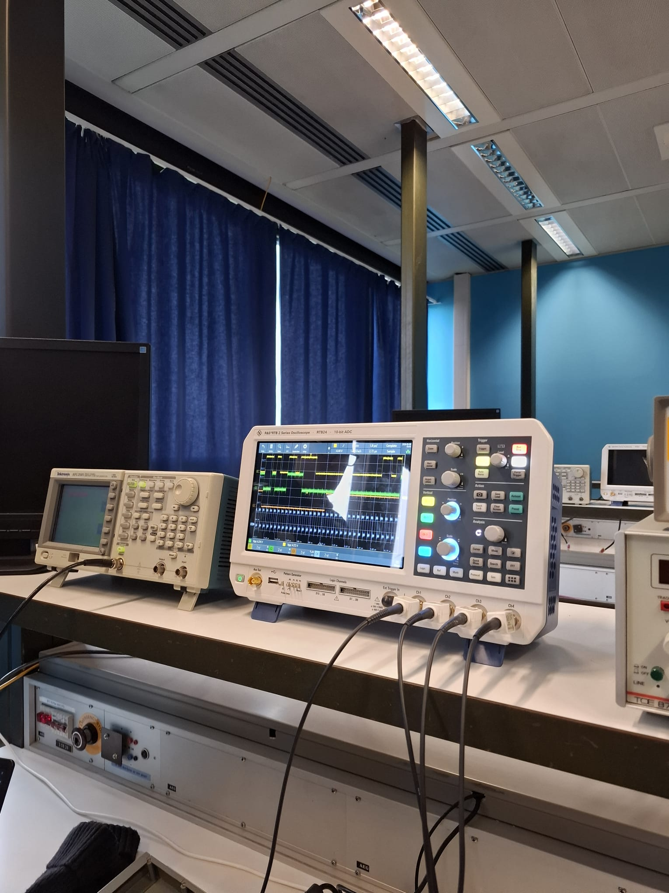

# TM4C1294 Ultrasonic Sensor Projects

This repository features my work on two bare-metal C implementations of HC-SR04 ultrasonic distance measurement on the **Texas Instruments TM4C1294NCPDT** microcontroller, built using Code Composer Studio (CCS). Both projects tackle the same sensing problem — measuring distance and reacting to it in real time — but use fundamentally different hardware timing strategies: a polling/timer-based approach and a fully interrupt-driven approach. The goal was to understand the trade-offs between blocking and non-blocking embedded architectures at the register level, without any hardware abstraction libraries.

---

## Hardware Setup & Lab

*TM4C1294 Connected LaunchPad with HC-SR04 ultrasonic sensor wired on a mini breadboard*

*Rohde & Schwarz RTB24 oscilloscope capturing the TRIG and ECHO signal timing during lab validation*

---

## Hardware

| Component | Detail |
|---|---|
| Microcontroller | TI Tiva TM4C1294NCPDT (ARM Cortex-M4F, 120 MHz) |
| Ultrasonic Sensor | HC-SR04 |
| IDE | Code Composer Studio (CCS) |
| Clock | 16 MHz system clock (SYSCLK) |

---

## Project 1 — Timer-Based Ultrasonic Sensor with LED Pendulum

**Folder:** `timerbased-ultrasonic-sensor-led-pendulum/`

### What it does

Measures distance using an HC-SR04 sensor and displays the result as a bar graph on 8 LEDs (PM0–PM7). A pendulum input on PL0 controls the measurement cycle — the system waits for the pendulum to swing left, fires the sensor, then waits for the right swing before displaying the result.

### How it works

- **Timer0** is used as a blocking delay timer (one-shot mode). The `sleep(ms)` function loads the timer with the correct tick count for the requested milliseconds and polls the raw interrupt status until timeout.
- **Timer1** is used as a free-running up-counter to timestamp the HC-SR04 echo pulse. The elapsed ticks between ECHO rising and falling edge are converted to microseconds, then to centimetres using the standard `distance = time_us / 58.0` formula.
- **Port D (PD0/PD1):** TRIG and ECHO pins for the ultrasonic sensor.
- **Port M (PM0–PM7):** 8 LED output pins showing distance as a progressive bar.
- **Port L (PL0):** Pendulum/switch input controlling measurement timing.

### LED bar mapping

| Distance | LEDs lit |
|---|---|
| < 10 cm | 1 (0x01) |
| < 20 cm | 2 (0x03) |
| < 30 cm | 3 (0x07) |
| < 40 cm | 4 (0x0F) |
| < 50 cm | 5 (0x1F) |
| < 60 cm | 6 (0x3F) |
| < 70 cm | 7 (0x7F) |
| ≥ 70 cm | 8 (0xFF) |

### Pin connections

| Signal | TM4C Pin |
|---|---|
| HC-SR04 TRIG | PD0 |
| HC-SR04 ECHO | PD1 |
| LEDs (bar graph) | PM0 – PM7 |
| Pendulum input | PL0 |

---

## Project 2 — Interrupt-Driven Ultrasonic Sensor

**Folder:** `ultrasonic-sensor-interrupt-based/`

### What it does

Continuously measures distance using the HC-SR04 sensor and prints the result over UART via `printf`. Unlike the timer-based project, this implementation is fully interrupt-driven — the CPU is never blocked waiting for sensor edges or delays.

### How it works

- **Timer0A interrupt (periodic, 0.5s interval):** Fires every 500 ms and generates the TRIG pulse by toggling PD0 high then low inside the ISR. Configured as a 32-bit periodic countdown timer with TATOIM enabled; IRQ 19 registered in NVIC.
- **GPIO Port D interrupt (both-edge on PD1):** Detects both the rising and falling edges of the ECHO pin using `IBE` (interrupt on both edges). On rising edge, Timer1 is reset and started. On falling edge, Timer1 is stopped and the elapsed tick count is read and converted to distance.
- **Timer1** runs as a free-running 32-bit up-counter (count-up periodic mode, max load 0xFFFFFFFF) used purely as a timestamp reference — it is never configured to generate interrupts itself.
- Distance is computed as: `distance_cm = (elapsed_ticks / 16.0) / 58.0`
- The `main()` loop only handles printing the result over serial — all measurement logic runs in ISRs.

### Key registers configured (direct register access, no driverlib)

| Register | Purpose |
|---|---|
| `SYSCTL_RCGCGPIO_R` | Enable GPIO clock for Port D |
| `GPIO_PORTD_AHB_IS_R` | Edge-sensitive interrupt mode |
| `GPIO_PORTD_AHB_IBE_R` | Interrupt on both edges |
| `GPIO_PORTD_AHB_IM_R` | Unmask ECHO pin interrupt |
| `NVIC_EN0_R` | Enable IRQ3 (Port D) and IRQ19 (Timer0A) |
| `TIMER0_TAMR_R` | Periodic countdown mode |
| `TIMER1_TAMR_R` | Count-up periodic mode (0x12) |

### Pin connections

| Signal | TM4C Pin |
|---|---|
| HC-SR04 TRIG | PD0 |
| HC-SR04 ECHO | PD1 |

---

## Key Differences Between Projects

| Feature | Project 1 (Timer-Based) | Project 2 (Interrupt-Driven) |
|---|---|---|
| Timing method | Polling (busy-wait) | ISR-driven |
| CPU blocked during measurement | Yes | No |
| TRIG generation | Manual in main loop | Timer0A ISR |
| ECHO capture | Polling GPIO in main loop | GPIO edge interrupt |
| Output | 8-LED bar graph | Serial printf |
| Complexity | Lower | Higher |

---

## Building and Flashing

1. Open Code Composer Studio
2. Import the project folder (`File → Import → CCS Projects`)
3. Build (`Ctrl+B`)
4. Connect the TM4C1294 LaunchPad via USB
5. Flash and debug (`Run → Debug`)

The target configuration file is located in `targetConfigs/Tiva TM4C1294NCPDT.ccxml`.

---

## Author

**Faizul Ahmed Robin**  
Bachelor of Science in Information Engineering  
Hamburg University of Applied Sciences (HAW Hamburg)
