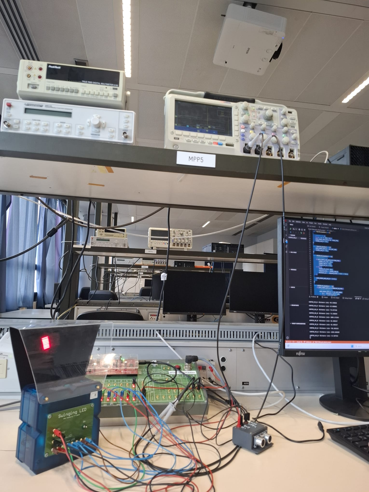
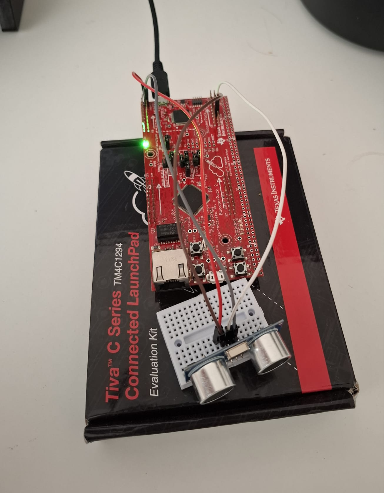
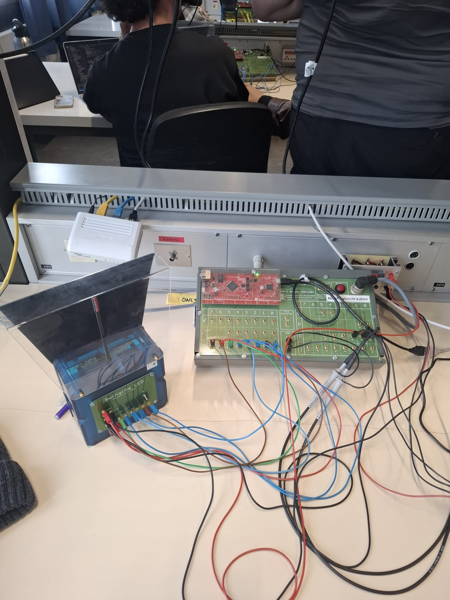
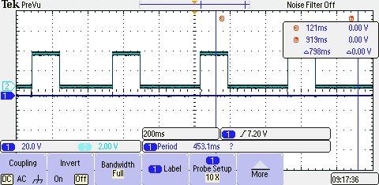
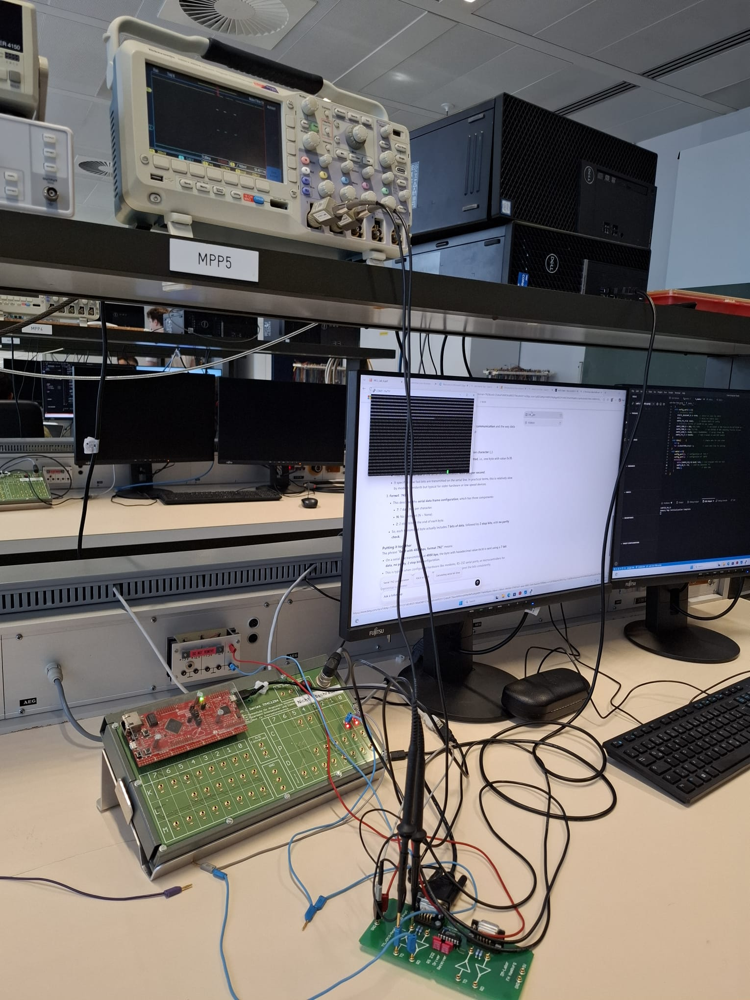
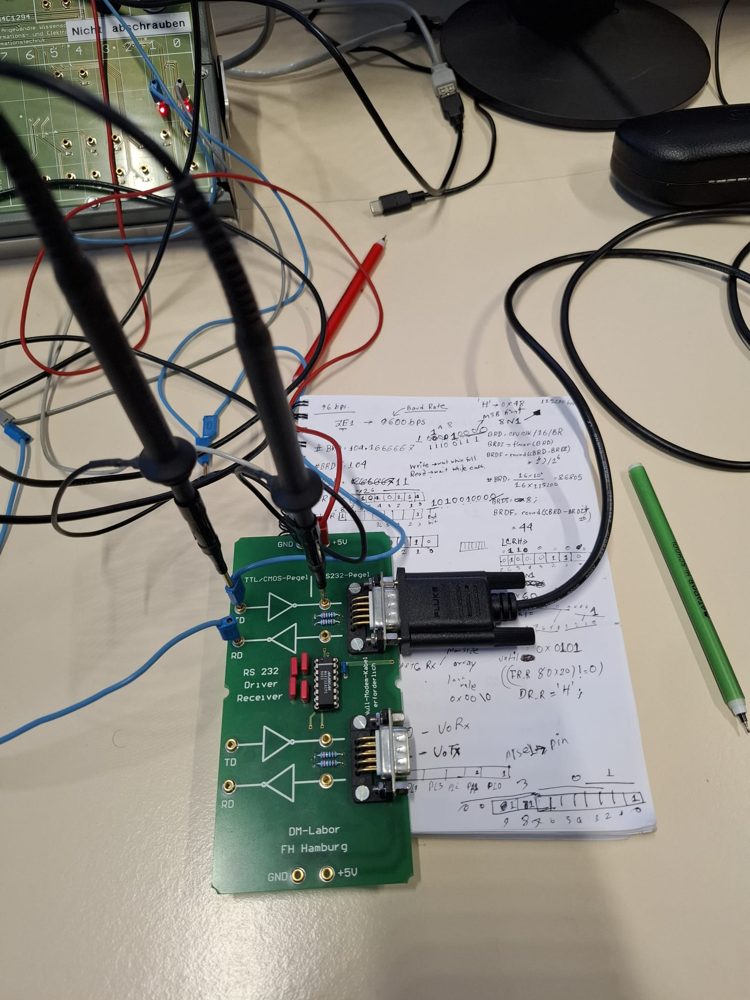
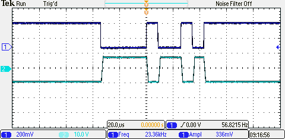
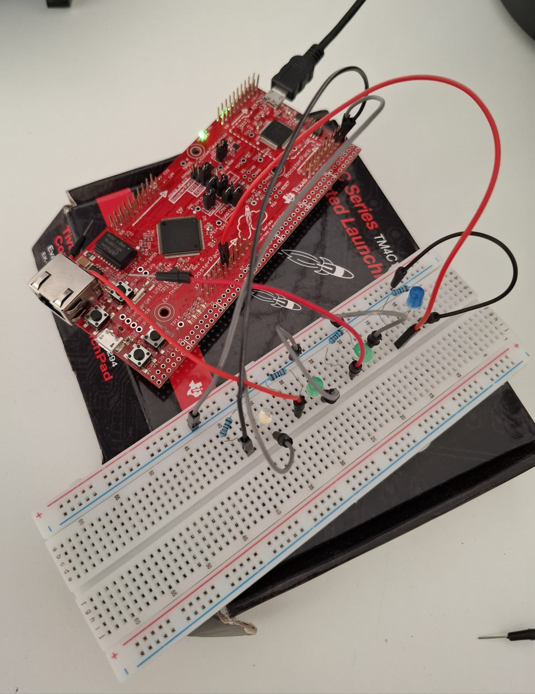
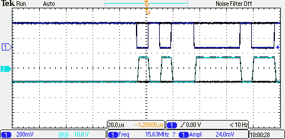

# TM4C1294 Projects

This repository features my bare-metal C work on the **Texas Instruments TM4C1294NCPDT** microcontroller, built using Code Composer Studio (CCS). The projects cover three areas: ultrasonic distance sensing with different timing architectures, and UART serial communication with a PC terminal. Across all projects the goal was the same — work directly at the register level, no hardware abstraction libraries, and understand exactly what is happening in the hardware.

---

## Hardware Setup & Lab

*Complete lab setup — TM4C1294 on breakout board, Swinging LED module (left), oscilloscope monitoring signals*
---

## Hardware

| Component | Detail |
|---|---|
| Microcontroller | TI Tiva TM4C1294NCPDT (ARM Cortex-M4F, 120 MHz) |
| Ultrasonic Sensor | HC-SR04 |
| Serial Interface | RS-232 Driver/Receiver Board (DM-Labor FH Hamburg) |
| IDE | Code Composer Studio (CCS) |
| Clock | 16 MHz system clock (SYSCLK) |

---

## Project 1 — Timer-Based Ultrasonic Sensor with LED Pendulum

**Folder:** `timerbased-ultrasonic-sensor-led-pendulum/`

### What it does

Measures distance using an HC-SR04 sensor and displays the result as a bar graph on 8 LEDs (PM0–PM7). A pendulum input on PL0 controls the measurement cycle — the system waits for the pendulum to swing left, fires the sensor, then waits for the right swing before displaying the result.

### How it works

- **Timer0** is used as a blocking delay timer (one-shot mode). The `sleep(ms)` function loads the timer with the correct tick count for the requested milliseconds and polls the raw interrupt status until timeout.
- **Timer1** is used as a free-running up-counter to timestamp the HC-SR04 echo pulse. The elapsed ticks between ECHO rising and falling edge are converted to microseconds, then to centimetres using the standard `distance = time_us / 58.0` formula.
- **Port D (PD0/PD1):** TRIG and ECHO pins for the ultrasonic sensor.
- **Port M (PM0–PM7):** 8 LED output pins showing distance as a progressive bar.
- **Port L (PL0):** Pendulum/switch input controlling measurement timing.

### LED bar mapping

| Distance | LEDs lit |
|---|---|
| < 10 cm | 1 (0x01) |
| < 20 cm | 2 (0x03) |
| < 30 cm | 3 (0x07) |
| < 40 cm | 4 (0x0F) |
| < 50 cm | 5 (0x1F) |
| < 60 cm | 6 (0x3F) |
| < 70 cm | 7 (0x7F) |
| ≥ 70 cm | 8 (0xFF) |

### Pin connections

| Signal | TM4C Pin |
|---|---|
| HC-SR04 TRIG | PD0 |
| HC-SR04 ECHO | PD1 |
| LEDs (bar graph) | PM0 – PM7 |
| Pendulum input | PL0 |

---

## Project 2 — Interrupt-Driven Ultrasonic Sensor

**Folder:** `ultrasonic-sensor-interrupt-based/`

### What it does

Continuously measures distance using the HC-SR04 sensor and prints the result over UART via `printf`. Unlike the timer-based project, this implementation is fully interrupt-driven — the CPU is never blocked waiting for sensor edges or delays.

### How it works

- **Timer0A interrupt (periodic, 0.5s interval):** Fires every 500 ms and generates the TRIG pulse by toggling PD0 high then low inside the ISR. Configured as a 32-bit periodic countdown timer with TATOIM enabled; IRQ 19 registered in NVIC.
- **GPIO Port D interrupt (both-edge on PD1):** Detects both the rising and falling edges of the ECHO pin using `IBE` (interrupt on both edges). On rising edge, Timer1 is reset and started. On falling edge, Timer1 is stopped and the elapsed tick count is read and converted to distance.
- **Timer1** runs as a free-running 32-bit up-counter (count-up periodic mode, max load 0xFFFFFFFF) used purely as a timestamp reference — it is never configured to generate interrupts itself.
- Distance is computed as: `distance_cm = (elapsed_ticks / 16.0) / 58.0`
- The `main()` loop only handles printing the result over serial — all measurement logic runs in ISRs.

### Key registers configured (direct register access, no driverlib)

| Register | Purpose |
|---|---|
| `SYSCTL_RCGCGPIO_R` | Enable GPIO clock for Port D |
| `GPIO_PORTD_AHB_IS_R` | Edge-sensitive interrupt mode |
| `GPIO_PORTD_AHB_IBE_R` | Interrupt on both edges |
| `GPIO_PORTD_AHB_IM_R` | Unmask ECHO pin interrupt |
| `NVIC_EN0_R` | Enable IRQ3 (Port D) and IRQ19 (Timer0A) |
| `TIMER0_TAMR_R` | Periodic countdown mode |
| `TIMER1_TAMR_R` | Count-up periodic mode (0x12) |

### Pin connections

| Signal | TM4C Pin |
|---|---|
| HC-SR04 TRIG | PD0 |
| HC-SR04 ECHO | PD1 |

---

## Project 3 — Interrupt-Driven Ultrasonic Sensor with LED Pendulum

**Folder:** `interruptbased-ultrasonic-sensor-led-pendulum/`

### What it does

Combines distance measurement with a physical pendulum input and LED output — all driven by interrupts. The HC-SR04 measures distance continuously. When the pendulum swings and triggers Port K, the 8 LEDs on Port M light up and stay on for a duration proportional to the measured distance, then turn off automatically via a third timer interrupt.

### How it works

- **Timer0A interrupt (periodic, 0.5s):** Fires the HC-SR04 TRIG pulse every 500ms from inside the ISR — same as Project 2.
- **GPIO Port D interrupt (both-edge on PD1):** Captures ECHO rising and falling edges. On rising edge, Timer1 resets and starts. On falling edge, Timer1 stops and distance is computed: `distance_cm = (elapsed_ticks / 16.0) / 58.0`
- **GPIO Port K interrupt (both-edge on PK0):** Detects the pendulum swing. On rising edge, all 8 LEDs turn on and Timer2 is loaded with a timeout proportional to distance: `load = ceil((distance_cm * 60 / 100) * 16000)`. Timer2 then counts down and automatically turns the LEDs off via its own ISR.
- **Timer2A interrupt:** Fires when the LED display timeout expires and clears all LEDs — no busy-wait, no blocking.
- **Timer1** runs as a free-running up-counter used purely for ECHO timestamping.

### Key addition vs Project 2

Project 2 only printed distance over serial. Project 3 adds two new interrupt sources — Port K for pendulum input and Timer2 for LED auto-off — making it a fully interrupt-driven system with three concurrent timers and two GPIO interrupt handlers running simultaneously.

*Quick prototyping setup — TM4C1294 LaunchPad with HC-SR04 sensor on mini breadboard*

*LED bar graph active during pendulum trigger — all 8 LEDs lit, Timer2 counting down to auto-off*

*Tektronix oscilloscope capture of TRIG and ECHO timing — period 453ms matching Timer0A 0.5s interval*

### Pin connections

| Signal | TM4C Pin |
|---|---|
| HC-SR04 TRIG | PD0 |
| HC-SR04 ECHO | PD1 |
| Pendulum input | PK0 |
| LEDs (bar graph) | PM0 – PM7 |

---

## UART Protocol Projects

These two projects focus on UART serial communication between the TM4C1294 and a PC terminal. Both use UART6 on Port P (PP0/PP1), configured at the register level without driverlib.

---

### Project 4 — UART Character Transmission (uart-char-TxRx-portp)

**Folder:** `uart-char-TxRx-portp/`

#### What it does

Continuously transmits a single character (ASCII `0x3B` = `;`) from the TM4C1294 over UART6 to a PC terminal. Implements multiple baud rate and data format configurations — testing 9600 bps 7E1, 38400 bps 8O1, and 4800 bps 7N2 alongside the default 115200 bps 8N1.

#### How it works

- UART6 TX configured on PP1 via alternate function (`AFSEL`, `PCTL = 0x10`)
- Baud rate divisors calculated manually: `BRD = fclk / (16 * baud)` — integer part to `IBRD`, fractional remainder to `FBRD`
- `LCRH` register configures word length, parity, and stop bits (e.g. `0x48` for 7E1, `0x60` for 8N1)
- Main loop polls `UART6_FR_R` TXFF flag before writing to `UART6_DR_R`

#### Key registers configured

| Register | Purpose |
|---|---|
| `SYSCTL_RCGCUART_R` | Enable UART6 clock |
| `UART6_IBRD_R` | Integer baud rate divisor |
| `UART6_FBRD_R` | Fractional baud rate divisor |
| `UART6_LCRH_R` | Word length, parity, stop bits |
| `UART6_CTL_R` | Enable TX and UART |
| `UART6_FR_R` | TX FIFO full flag (polling) |

#### Lab setup and oscilloscope captures

*HAW Hamburg lab setup — TM4C1294 on breakout board, oscilloscope probing UART TX/RX lines*

*RS-232 Driver/Receiver board (DM-Labor FH Hamburg) with handwritten IBRD/FBRD derivations for multiple baud rates*

*Two-channel capture — UART TX (Ch1) and RX (Ch2) simultaneously, bidirectional communication verified*

---

### Project 5 — UART Terminal with LED Command Decoder (terminal-com8-test)

**Folder:** `terminal-com8-test/`

#### What it does

Full bidirectional UART terminal: receives character strings from PuTTY on PC, stores them in a buffer, prints them via `printf`, and decodes `led<+|-><0|1|2|3>` commands to toggle individual LEDs on Port M.

#### How it works

- TX (PP1) and RX (PP0) both configured — `UART6_CTL_R |= 0x0301` enables both
- Prompt sequence sends `\r\n>` after each command creating a terminal-style interface
- `read_char()` polls `UART6_FR_R` RXFE flag, stores into `buffer[MAXSIZE]` until `\r` or buffer full, then null-terminates
- Command decoder parses `led<+|-><0|1|2|3>` and sets or clears bits on `GPIO_PORTM_DATA_R` (PM0–PM3)
- Invalid commands silently ignored; valid commands toggle the corresponding LED immediately

#### Command syntax

| Command | Action |
|---|---|
| `led+0` to `led+3` | Turn on LED PM0–PM3 |
| `led-0` to `led-3` | Turn off LED PM0–PM3 |

#### Pin connections

| Signal | TM4C Pin |
|---|---|
| UART6 TX | PP1 |
| UART6 RX | PP0 |
| LEDs | PM0 – PM3 |

*Quick prototyping — TM4C1294 with breadboard LEDs on Port M for command decoder validation*

*High-speed UART signal capture at 15.63MHz — TX and RX during active terminal communication*

---

## Key Differences Between Projects

| Feature | P1 Timer-Based | P2 Interrupt | P3 Interrupt + Pendulum | P4 UART TX | P5 UART Terminal |
|---|---|---|---|---|---|
| Timing method | Polling | ISR-driven | ISR-driven | Polling | Polling |
| CPU blocked | Yes | No | No | Yes | Yes |
| Output | LED bar graph | Serial printf | LED bar (timed) | UART TX char | UART terminal |
| Active interrupts | 0 | 2 | 4 | 0 | 0 |
| Bidirectional UART | No | No | No | No | Yes |

---

## Building and Flashing

1. Open Code Composer Studio
2. Import the project folder (`File → Import → CCS Projects`)
3. Build (`Ctrl+B`)
4. Connect the TM4C1294 LaunchPad via USB
5. Flash and debug (`Run → Debug`)

The target configuration file is located in `targetConfigs/Tiva TM4C1294NCPDT.ccxml`.

---

## Author

**Faizul Ahmed Robin**  
Bachelor of Science in Information Engineering  
Hamburg University of Applied Sciences (HAW Hamburg)
